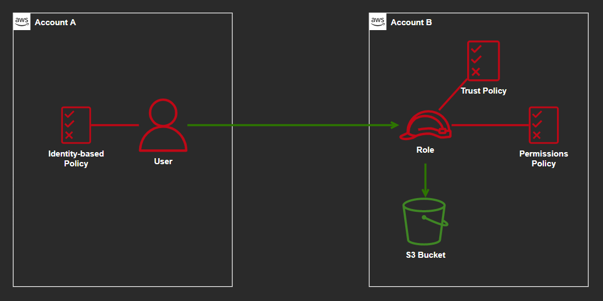

# AWS Cross-account S3 Access



## Create user

Create the user `Anne` and the associated policies:

```sh
# Create user
aws iam create-user --user-name 'Anne'

# Create policy
aws iam create-policy --policy-name 'anne-s3' --policy-document 'file://anne-s3.json'

# Attach policy (replace account id)
aws iam attach-user-policy --user-name 'Anne' --policy-arn "arn:aws:iam::$account_A_id:policy/anne-s3"

# List policies attached to Anne
aws iam list-attached-user-policies --user-name 'Anne'
```

Policy to be created:

```json
{
  "Version": "2012-10-17",
  "Statement": [
    {
      "Effect": "Allow",
      "Action": [
        "iam:ListRoles",
        "sts:AssumeRole"
      ],
      "Resource": "*"
    }
  ]
}
```

## Access key

```sh
# Create access keys and record access keys for later use
aws iam create-access-key --user-name 'Anne'

# Configure CLI with profile for Anne
aws configure --profile 'Anne'

# Shows the identity being used to execute commands (without any profile)
aws sts get-caller-identity
```

Connect to account B and create this role (replace account A id) with `AmazonS3FullAccess` policy and name it `cross-account-s3-access`:

```json
{
  "Version": "2012-10-17",
  "Statement": [
    {
      "Effect": "Allow",
      "Principal": {
        "AWS": "arn:aws:iam::ACCOUNT_A_ID:root"
      },
      "Action": "sts:AssumeRole",
      "Condition": {
        "StringEquals": {
          "sts:ExternalId": "XX9812DDF2V"
        }
      }
    }
  ]
}
```


```sh
# Assume the role in Account B with external ID
aws sts assume-role --profile 'Anne' --role-arn "arn:aws:iam::$accountB:role/cross-account-s3-access" --role-session-name 'AWSCLI-Session' --external-id 'XX9812DDF2V'

# Configure access key ID, secret access key and session token as environment variables
export AWS_ACCESS_KEY_ID=RoleAccessKeyID
export AWS_SECRET_ACCESS_KEY=RoleSecretKey
export AWS_SESSION_TOKEN=RoleSessionToken

# Shows that we're now executing commands as the assumed role
aws sts get-caller-identity
```

You should now be able to use commands cross-account.

### Run S3 commands on Account B

```sh
# Run S3 commands to list bucket, make bucket, and delete bucket
aws s3 ls
aws s3 mb s3://test-create-bucket-account-b-e32e090f90d
aws s3 rb s3://test-create-bucket-account-b-e32e090f90d

# Remove environment variables
unset AWS_ACCESS_KEY_ID AWS_SECRET_ACCESS_KEY AWS_SESSION_TOKEN

# Show that we are now executing commands as our Admin user again
aws sts get-caller-identity
```
